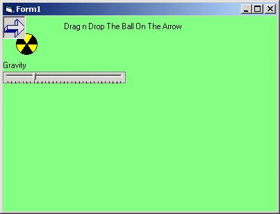



## A Nice Gravity Effect \(Simulation\)

### Description

A nice program the shows how to create a gravity effect with vb..you can adjuct the gravitys power as you like...Have Fun...:) (the animations above isn't exactly smooth but the programs animation is fine..i did that to reduce the gif size :P )
 
### More Info
 

             |
---                |---
**Submitted On**   |2001-01-07 03:12:30
**By**             |[George Papadopoulos  \- VirusFree](https://github.com/Planet-Source-Code/PSCIndex/blob/master/ByAuthor/george-papadopoulos-virusfree.md)
**Level**          |Beginner
**User Rating**    |4.6 (23 globes from 5 users)
**Compatibility**  |VB 5\.0, VB 6\.0
**Category**       |[Graphics](https://github.com/Planet-Source-Code/PSCIndex/blob/master/ByCategory/graphics__1-46.md)
**World**          |[Visual Basic](https://github.com/Planet-Source-Code/PSCIndex/blob/master/ByWorld/visual-basic.md)
**Archive File**   |[A\_Nice\_Gra968356202002\.zip](https://github.com/Planet-Source-Code/george-papadopoulos-virusfree-a-nice-gravity-effect-simulation__1-36069/archive/master.zip)

